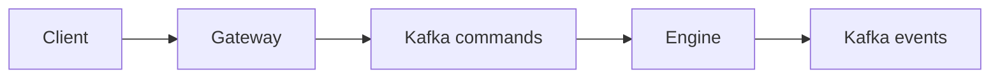

# Project Memory

This project is a Java 27 modular CLOB implementation under package `br.com.mb`.

Always run shell commands through `rtk` in this workspace, for example:

```bash
rtk ./gradlew clean test
rtk git status --short
```

## Current Architecture

Modules:

- `shared`: FIX parsing and small shared value objects.
- `command-log`: Kafka command/event producer and consumer adapters.
- `gateway`: HTTP ingress that accepts FIX text and publishes normalized FIX to Kafka `commands`.
- `engine`: consumes FIX commands, validates order intake, keeps in-memory order books, performs basic matching, publishes FIX events.
- `ledger`: placeholder for balances and accounting.

The default package is `br.com.mb`.

## Runtime Flow



## Current Engine Behavior

- Supports inbound FIX `35=D` NewOrderSingle and `35=F` OrderCancelRequest.
- Keeps one in-memory `OrderBook` per instrument.
- Instruments currently known: `BTC/BRL`, `ETH/BRL`, `ETH/BTC`.
- Uses price-time priority.
- Uses maker price for trades.
- Publishes FIX `ExecutionReport(35=8)` for accepted/rested, fills, and cancels.
- Publishes FIX `BusinessMessageReject(35=j)` for validation/business rejection.
- Does not implement balances, ledger, self-trade prevention, snapshots, or replay yet.

## Important Commands

```bash
rtk ./gradlew clean test
rtk docker compose config
rtk docker compose up -d
rtk ./gradlew :engine:runEngine
rtk ./gradlew :gateway:runGateway
```

## Commit Style So Far

Keep commits small and thematic. Existing examples:

- `feat: add shared FIX message parser`
- `feat: add Kafka command log adapters`
- `feat: publish FIX commands through gateway`
- `feat: consume FIX commands in engine`
- `feat: validate engine order intake`
- `feat: store accepted orders in memory book`

## Next Likely Work

The next major phase should introduce ledger/balance reservation:

- account balances with `available` and `locked`
- credit/debit commands
- reserve quote for buys and base for sells before matching
- settle trades after matching
- test asset conservation
