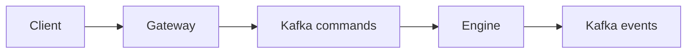

# Memória do Projeto

Este projeto é uma implementação modular Java 27 de um CLOB sob o pacote `br.com.mb`.

Sempre execute comandos de shell via `rtk` neste workspace, por exemplo:

```bash
rtk ./gradlew clean test
rtk git status --short
```

## Arquitetura Atual

Módulos:

- `shared`: parsing FIX e pequenos value objects compartilhados.
- `command-log`: adapters Kafka para produzir e consumir comandos/eventos.
- `gateway`: entrada HTTP que aceita FIX textual e publica FIX normalizado no Kafka `commands`.
- `engine`: consome comandos FIX, valida intake, mantém order books em memória, executa matching básico e publica eventos FIX.
- `ledger`: placeholder para saldos e contabilidade.

O pacote base padrão é `br.com.mb`.

## Fluxo em Execução



## Comportamento Atual do Engine

- Suporta FIX inbound `35=D` NewOrderSingle e `35=F` OrderCancelRequest.
- Mantém um `OrderBook` em memória por instrumento.
- Instrumentos conhecidos atualmente: `BTC/BRL`, `ETH/BRL`, `ETH/BTC`.
- Usa prioridade preço-tempo.
- Usa preço do maker para trades.
- Publica FIX `ExecutionReport(35=8)` para ordens aceitas/descansando, fills e cancelamentos.
- Publica FIX `BusinessMessageReject(35=j)` para rejeições de validação/negócio.
- Ainda não implementa saldos, ledger, prevenção de self-trade, snapshots ou replay.

## Comandos Importantes

```bash
rtk ./gradlew clean test
rtk docker compose config
rtk docker compose up -d
rtk ./gradlew :engine:runEngine
rtk ./gradlew :gateway:runGateway
```

## Estilo de Commit Usado Até Aqui

Manter commits pequenos e temáticos. Exemplos existentes:

- `feat: add shared FIX message parser`
- `feat: add Kafka command log adapters`
- `feat: publish FIX commands through gateway`
- `feat: consume FIX commands in engine`
- `feat: validate engine order intake`
- `feat: store accepted orders in memory book`
- `feat: match limit orders in memory book`

## Próximo Trabalho Provável

A próxima fase grande deve introduzir ledger/reserva de saldo:

- saldos de conta com `available` e `locked`
- comandos de crédito/débito
- reserva de quote para compras e base para vendas antes do matching
- liquidação após trades
- teste de conservação de ativos
