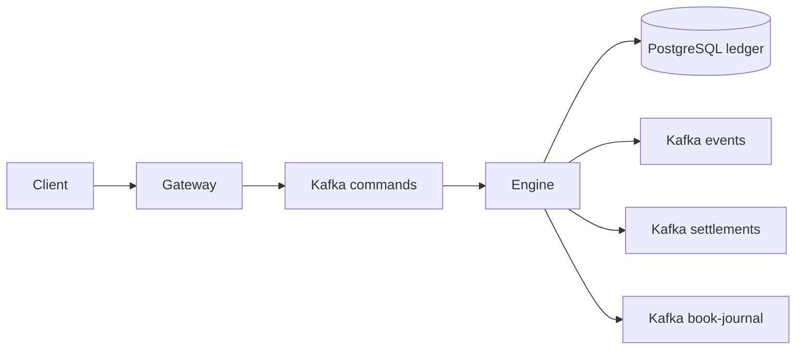

# Memória do Projeto

Este projeto é uma implementação modular Java 27 de um CLOB sob o pacote `br.com.mb`.

Sempre execute comandos de shell via `rtk` neste workspace, por exemplo:

```bash
rtk ./gradlew clean test
rtk git status --short
```

## Arquitetura Atual

Módulos:

- `shared`: parsing FIX e pequenos value objects compartilhados.
- `command-log`: adapters Kafka para produzir e consumir comandos/eventos.
- `gateway`: entrada HTTP que aceita FIX textual e publica FIX normalizado no Kafka `commands`.
- `engine`: recupera book via `book-journal`, consome comandos FIX, credita funding, valida intake, reserva saldo no ledger, mantém order books em memória, executa matching básico, publica journal de liquidação em Kafka e publica eventos FIX.
- `ledger`: domínio de saldos com `available`, `locked`, reserva, liberação e consumo assíncrono de liquidação persistido em PostgreSQL via Spring Data JPA.

O pacote base padrão é `br.com.mb`.

## Fluxo em Execução



## Comportamento Atual do Engine

- Suporta FIX inbound `35=D` NewOrderSingle, `35=F` OrderCancelRequest e `35=U1` FundingCredit interno.
- Mantém um `OrderBook` em memória por instrumento.
- Instrumentos conhecidos atualmente: `BTC/BRL`, `ETH/BRL`, `ETH/BTC`.
- O catálogo do engine mapeia instrumento para base/cotação.
- Antes do matching, compra reserva `price * quantity` no ativo de cotação e venda reserva `quantity` no ativo base.
- Cancelamento aceito libera a reserva restante da ordem aberta.
- Funding `35=U1` credita saldo disponível usando `Account(1)`, `ClOrdID(11)`, `Asset(55)` e `Amount(38)`.
- Funding duplicado com o mesmo `ClOrdID(11)` não duplica crédito, pois o ledger persiste o comando processado em PostgreSQL.
- Funding duplicado com mesmo `ClOrdID(11)` e payload divergente é rejeitado.
- Usa prioridade preço-tempo.
- Usa preço do maker para trades.
- Persiste mutações aceitas do book no tópico `book-journal`: `35=U4` para ordem aceita e `35=U5` para cancelamento aceito.
- Cada ordem aceita recebe `entrySequence` monotônico, publicado em `U4` como tag interna `10003`.
- Cada ordem aceita recebe `enteredAt` em ISO-8601/UTC, publicado em `U4` como tag interna `10004` para auditoria.
- No startup, o engine reconstrói `EngineState` por replay de `book-journal`.
- Publica cada trade no tópico `settlements` como FIX-like `35=U2`.
- Compra taker executada abaixo do preço limite publica liberação de price improvement como FIX-like `35=U3`.
- Publica FIX `ExecutionReport(35=8)` para ordens aceitas/descansando, fills e cancelamentos.
- Publica FIX `BusinessMessageReject(35=j)` para rejeições de validação/negócio.
- Ainda não implementa prevenção de self-trade ou snapshots do book.

## Comportamento Atual do Ledger

- O runtime padrão usa `PostgresLedgerFactory` e `JpaLedger`.
- Persistência em PostgreSQL na tabela `ledger_balances`.
- Usa Spring Data JPA 4.1.x via Spring Boot BOM 4.1.1.
- Configuração padrão local: `jdbc:postgresql://localhost:5432/mb`, usuário `mb`, senha `mb`.
- Variáveis suportadas: `MB_LEDGER_JDBC_URL`, `MB_LEDGER_USERNAME`, `MB_LEDGER_PASSWORD`, `MB_LEDGER_HBM2DDL_AUTO`, `MB_LEDGER_SHOW_SQL`.
- Mantém `AssetBalance` por conta/ativo com buckets `available` e `locked`.
- `credit` aumenta saldo disponível.
- `reserve` move saldo disponível para bloqueado.
- `release` devolve saldo bloqueado para disponível.
- `settle` liquida trades consumindo saldos bloqueados conforme o lado do maker.
- O ledger valida todos os saldos bloqueados necessários antes de mutar contas na liquidação.
- `LedgerSettlementApplication` consome `settlements` e aplica `U2/U3` idempotentemente usando `ExecID(17)`.

## Comandos Importantes

```bash
rtk ./gradlew clean test
rtk docker compose config
rtk docker compose up -d
rtk ./gradlew :ledger:runLedgerSettlements
rtk ./gradlew :engine:runEngine
rtk ./gradlew :gateway:runGateway
```

## Estilo de Commit Usado Até Aqui

Manter commits pequenos e temáticos. Exemplos existentes:

- `feat: add shared FIX message parser`
- `feat: add Kafka command log adapters`
- `feat: publish FIX commands through gateway`
- `feat: consume FIX commands in engine`
- `feat: validate engine order intake`
- `feat: store accepted orders in memory book`
- `feat: match limit orders in memory book`

## Pendências Mapeadas

- reconciliação de liquidações rejeitadas pelo consumidor
- prevenção de self-trade
- snapshots do book
- eventos contábeis persistidos/publicados para liquidação

## Próximo Trabalho Provável

A próxima fase grande deve endurecer consistência e replay:

- estratégia de reconciliação quando uma liquidação falhar após matching
- snapshots do book para reduzir tempo de recover
- eventos contábeis de liquidação
