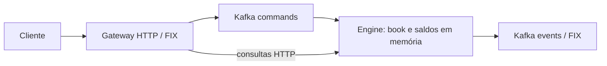

# CLOB — livro de ofertas e matching

Implementação do exercício técnico MB em Java 25. Insere e cancela ordens limitadas, executa matching parcial ou completo e gerencia saldos/reservas. Crédito, débito e consultas de saldo/book também estão implementados.

Kafka permanece no fluxo de comandos e eventos. Books e saldos vivem **em memória no mesmo engine**; os trades são liquidados durante o processamento do comando. Não há PostgreSQL, ORM, snapshots, replay ou processo de liquidação separado.



## Compilar e testar

Pré-requisito: JDK 25. O Gradle Wrapper está versionado, e a toolchain pode ser provisionada pelo resolver Foojay. Testes unitários e HTTP não exigem Kafka ou banco.

```bash
rtk ./gradlew clean test
```

## Executar

Para execução completa, use Docker com Compose para subir **apenas Kafka**:

```bash
rtk docker compose up -d kafka kafka-init
```

Em dois terminais, inicie primeiro o engine e espere a mensagem `Engine ready`; depois inicie o gateway:

```bash
rtk ./gradlew :engine:runEngine
rtk ./gradlew :gateway:runGateway
```

O gateway atende em `http://localhost:8080`; as consultas internas do engine ficam em `http://127.0.0.1:8081`. Execute **um engine ativo** e mantenha **uma partição de commands**. O startup recusa tópicos commands com outra quantidade de partições.

## Verificação automatizada

Com Kafka saudável e Python 3 instalado:

```bash
rtk proxy python3 scripts/verify-exercise.py
```

O script cria dois tópicos exclusivos, inicia gateway/engine em portas livres, verifica as operações e remove seus processos, tópicos e grupos ao terminar. Inclui o exemplo de 1 BTC por 500 mil BRL, matching parcial, reserva, melhoria de preço, cancelamento, rejeições, reenvios e reinício com estado vazio. Logs ficam em `build/verify_*`. Não acessa PostgreSQL nem dados de outros tópicos.

## Exemplo manual

`POST /commands` recebe FIX textual com `|` ou SOH. HTTP **202 confirma publicação no Kafka**, não sucesso de negócio. A resposta do engine é enviada em `events`: `35=8` para execução/aceitação e `35=j` para rejeição. A consulta posterior pode acontecer antes de o comando ser consumido; aguarde o evento ou consulte até observar o resultado.

```bash
# Crédito: A recebe BRL e B recebe BTC.
curl -i http://localhost:8080/commands --data '8=FIX.4.4|35=U1|49=gateway|1=A|11=fund-A|55=BRL|38=600000|'
curl -i http://localhost:8080/commands --data '8=FIX.4.4|35=U1|49=gateway|1=B|11=fund-B|55=BTC|38=1|'

# Aguarde os créditos antes de enviar a venda e a compra.
curl -i http://localhost:8080/commands --data '8=FIX.4.4|35=D|49=gateway|1=B|11=sell-1|55=BTC/BRL|54=2|44=500000|38=1|'
curl -i http://localhost:8080/commands --data '8=FIX.4.4|35=D|49=gateway|1=A|11=buy-1|55=BTC/BRL|54=1|44=500000|38=1|'

# Débito usa apenas saldo disponível.
curl -i http://localhost:8080/commands --data '8=FIX.4.4|35=U6|49=gateway|1=A|11=debit-A|55=BRL|38=50000|'

# Ordem sem cruzamento e cancelamento por sua conta proprietária.
curl -i http://localhost:8080/commands --data '8=FIX.4.4|35=D|49=gateway|1=A|11=resting-A|55=BTC/BRL|54=1|44=100|38=1|'
curl -i http://localhost:8080/commands --data '8=FIX.4.4|35=F|49=gateway|1=A|11=cancel-A|55=BTC/BRL|41=resting-A|'

curl 'http://localhost:8080/accounts/A/balances?asset=BRL'
curl 'http://localhost:8080/accounts/A/balances?asset=BTC'
curl 'http://localhost:8080/books?instrument=BTC%2FBRL'

# Ler respostas; o histórico de eventos não representa o estado de uma sessão nova.
rtk docker exec mb-kafka /opt/kafka/bin/kafka-console-consumer.sh --bootstrap-server localhost:9092 --topic events --from-beginning
```

Após processamento, A tem 1 BTC e 50000 BRL disponíveis; B tem 500000 BRL disponíveis. O book está vazio e as reservas foram liberadas/consumidas.

## Regras e premissas

- Mercados: `BTC/BRL`, `ETH/BRL`, `ETH/BTC`. Apenas ordens limitadas; o resto não executado descansa no book.
- Prioridade preço-tempo e preço do maker. Uma nova ordem que alcançaria contraparte da mesma conta é rejeitada integralmente.
- Preço e quantidade são `long` positivos. Os exemplos usam unidades inteiras; não existe escala decimal implícita. Multiplicação/soma financeira verifica overflow.
- Compra reserva preço-limite × quantidade na cotação; venda reserva quantidade do ativo base. Cancelamento libera só o restante. Melhorias de preço são liberadas imediatamente.
- O engine calcula os fills sem alterar os makers, valida um lote financeiro com apenas as contas/ativos afetados e então atualiza o book. Nenhum book é recarregado ou copiado integralmente por comando.
- Comandos e consultas são serializados pelo mesmo monitor do handler. Matching e liquidação são síncronos no engine; Kafka continua sendo uma fronteira assíncrona.
- Reenvios iguais com `MsgType:ClOrdID` não repetem efeitos **na mesma sessão**; conteúdo/chave divergente é rejeitado. Use IDs novos para novos pedidos, inclusive depois de uma rejeição. Respostas podem ser repetidas quando a publicação falha.
- Reiniciar o engine **apaga books, saldos e deduplicação**. Cada startup usa um grupo Kafka novo e estabelece posição no fim do tópico antes de abrir a consulta HTTP. Não há recuperação do histórico; comandos enviados antes da prontidão ou durante indisponibilidade podem ficar fora da nova sessão, mesmo com HTTP 202.
- Não há garantia de failover, operação com múltiplos engines, exactly once ou entrega durável de eventos após queda do processo. O Kafka retém mensagens, mas não torna o estado em memória durável.
- Conta é declarada pelo cliente; autenticação/autorização não fazem parte desta demonstração. Não exponha esse gateway como serviço financeiro de produção.

## Configuração

| Variável | Default | Uso |
|---|---|---|
| `KAFKA_BOOTSTRAP_SERVERS` | `localhost:9092` | Broker para gateway/engine. |
| `KAFKA_COMMANDS_TOPIC` | `commands` | Entrada do engine, uma partição. |
| `KAFKA_EVENTS_TOPIC` | `events` | Respostas FIX. |
| `GATEWAY_HOST` / `GATEWAY_PORT` | `0.0.0.0` / `8080` | Servidor público local. |
| `ENGINE_HOST` / `ENGINE_PORT` | `127.0.0.1` / `8081` | Consultas de saldo e book no engine. |
| `ENGINE_URL` | `http://127.0.0.1:8081` | Destino das consultas do gateway. |

Arquitetura: [DESIGN](docs/DESIGN.md). Decisões e riscos: [ARCHITECTURAL-DECISIONS](docs/ARCHITECTURAL-DECISIONS.md). Fluxos/classes: [CLASS-FLOWS](docs/CLASS-FLOWS.md). Estrutura do book: [BOOK-STRUCTURE](docs/BOOK-STRUCTURE.md). Consistência: [ENGINE-CONSISTENCY](docs/ENGINE-CONSISTENCY.md). Operação: [RUNBOOK](docs/RUNBOOK.md).
